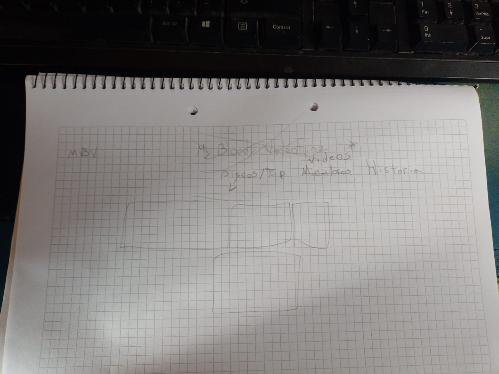
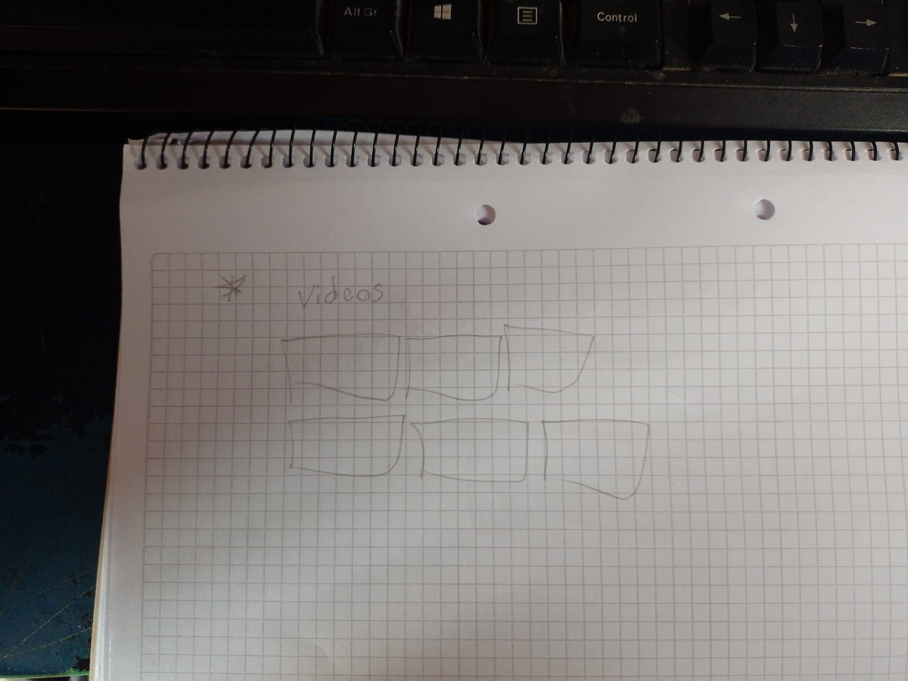

# web-integrador

La pagina va a tratar de hablar sobre mbv y sobre su trayectoria ya que ellos no dieron muchas entrevistas.

## Autor Tobias Bontempelli 

1. item 1
2. item 2

# 1 - Diseño UX

### 2 - Ideas del Cliente y Contenido
Pagina web de presentacion

1.Presentacion: Introduccion al artista / Trabajos mas relevantes / audio

2.Historia Trayectoria: Texto / Fotos / Cronologia

3.Contacto: Redes sociales / mails / telefonos / ubicacion

## Diseño UI

### 1 - Fuente
 
 1. font:"https://fonts.googleapis.com/css2?family=Poppins:ital,wght@1,600&display=swap" rel="stylesheet">

### 2 - Colores

- https://www.color-hex.com/color-palette/54315

### 3 - Imagenes

1. imagen1
2. imagen 2
3. imagen 3
4. imagen 4
5. foto11
6. foto2

### 3 - Wireframe

Pagina 1:Presentacion

Pagina 2:Videos

